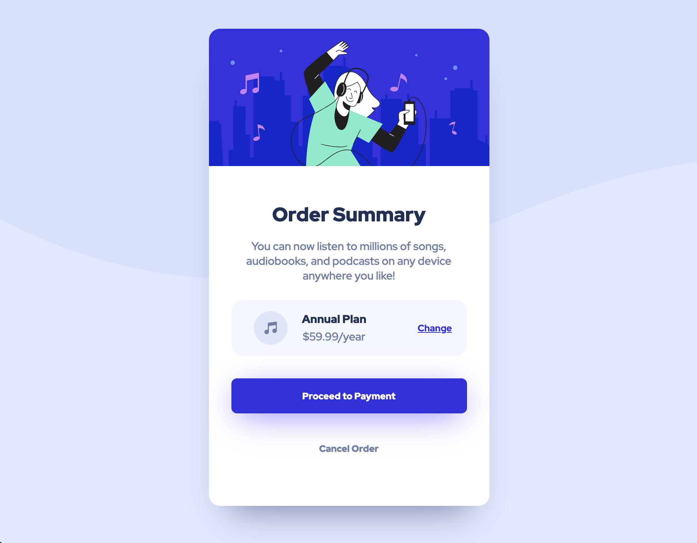

# Frontend Mentor - Order summary card solution

This is a solution to the [Order summary card challenge on Frontend Mentor](https://www.frontendmentor.io/challenges/order-summary-component-QlPmajDUj). Frontend Mentor challenges help you improve your coding skills by building realistic projects. 

## Table of contents

- [Overview](#overview)
  - [The challenge](#the-challenge)
  - [Screenshot](#screenshot)
  - [Links](#links)
- [My process](#my-process)
  - [Built with](#built-with)
  - [What I learned](#what-i-learned)
  - [Continued development](#continued-development)
  - [Useful resources](#useful-resources)
- [Author](#author)
- [Acknowledgments](#acknowledgments)

**Note: Delete this note and update the table of contents based on what sections you keep.**

## Overview

### The challenge

Users should be able to:

- See hover states for interactive elements

### Screenshot

### Links

- Solution URL: [Github Repo](https://github.com/ziggysauce/fem.io/tree/main/order-summary-component)
- Live Site URL: [Live Site](https://ziggysauce-order-summary-component.netlify.app/)

## My process

### Built with

- Semantic HTML5 markup
- CSS custom properties
- Flexbox
- Mobile-first workflow

### What I learned

- Importing font family and usage
- Using CSS media queries

### Continued development

- CSS box shadow
- CSS grid
- Usage of classes versus IDs vs inline styling

### Useful resources

- Stack overflow
- [CSS Flexbox](https://css-tricks.com/snippets/css/a-guide-to-flexbox/)
- [CSS Box Shadow](https://developer.mozilla.org/en-US/docs/Web/CSS/box-shadow)

## Author

- Website - [Dan Nguyen](https://danieltnguyen.com/)
- Frontend Mentor - [@ziggysauce](https://www.frontendmentor.io/profile/ziggysauce)
- Twitter - [@ziggysauce](https://twitter.com/ziggysauce)
- Medium - [@ziggysauce](https://medium.com/@ziggysauce)

## Acknowledgments

Working alongside [Justin](https://github.com/jduong09)
